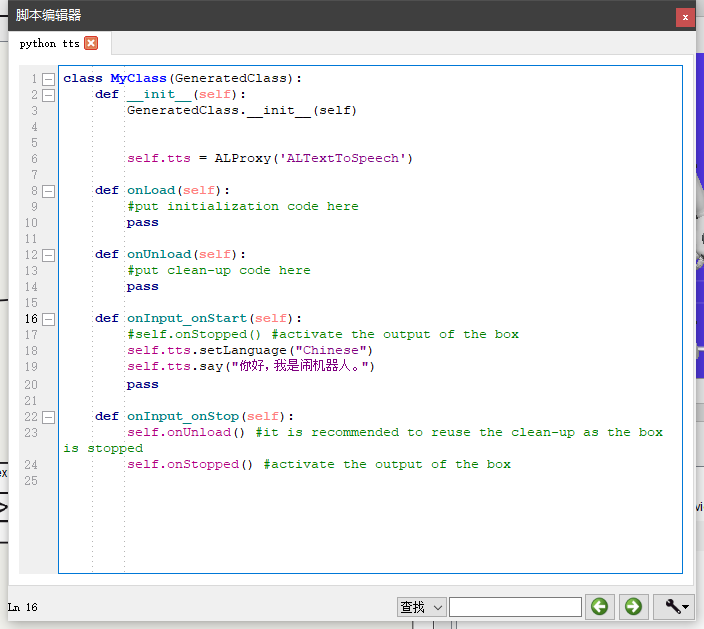

# Nao-robot-control-system-based-on-AIML-chatbot

# 简单使用和保养
## 开关机和马达
开机是按一下，后来按一下相当于重启了一次程序，3是播报IP地址，5秒是关机，8秒是强制关机。
## 电池
3月左右不用需要取下电池。夏天5-8小时，冬天8-10小时充电。活动时间1-1.5小时。
## 下载
https://developer.softbankrobotics.com/nao6/downloads/nao6-downloads-windows

## 缺乏VCOMP120.DLL
实际上是缺乏32位VCOMP120.DLL文件。因为vc++2008 32位安装之后只有VCOMP100.DLL和VCOMP140.DLL，可能VCOMP120.DLL被淘汰了。Choregraphe是32位的程序。

我的轻薄办公本不可以运行，游戏笔记本反而可以运行。说明还是环境的问题。游戏笔记本环境配置齐全

[Choregraphe-bin.exe – Missing Files error fix](https://www.robotlab.com/support/topic/nao)
# 开发文档
http://doc.aldebaran.com/2-8/index_dev_guide.html

# 两种编程方式

## Choregraphe盒子编程
可视化编程教程
https://www.bilibili.com/video/BV18s411B7cN?p=7&spm_id_from=pageDriver
其实很不方便，时间轴动作难以使用。除非用来编舞等过于复杂的持续动作规划。复杂的连接线也许让人眼花缭乱。计算机程序员不建议使用，仅仅用于测试。
## Choregraphe盒子中内嵌python代码
有没有感觉和arduino和unity3d相似啊，这些触发式的程序大同小异。所以有句话叫if语句能完成所有的编程语句。

http://doc.aldebaran.com/2-8/getting_started/helloworld_choregraphe_script.html
http://doc.aldebaran.com/2-1/software/choregraphe/objects/python_script.html

## python代码
官方教程
### 语音合成
http://doc.aldebaran.com/2-1/naoqi/audio/altexttospeech-tuto.html
### 动作运动
http://doc.aldebaran.com/2-1/dev/python/examples/motion/index.html
似乎NAO自带了动作防止摔系统限制了输入动作序列的执行。

# 模拟器

## Choregraphe 自带模拟器

可以局域网下跨电脑连接虚拟机器人。但是不支持OpenRoberta下载并写入虚拟机器人文件

## webot

http://doc.aldebaran.com/2-1/software/webots/webots_index.html#getting-started

## [v-rep](http://www.coppeliarobotics.com/downloads.html)

一个别人设置好的模拟器，似乎Choregraphe 会争用端口。

https://github.com/PierreJac/Project-NAO-Control

# 相关研究

## OpenRoberta

图形化编程输出python写入NAO机器人https://github.com/OpenRoberta?page=1

使用Open Roberta Connector建立OpenRoberta编辑器网页和本地机器人的连接，不要手动输入IP地址和端口，点击scan自动检测。因为外网出口IP和本地局域网不一样，尚不知道真正IP和端口。
# 后记
很多人说NAO机器人没什么用，我也这么认为。但是我很讨厌现在互联网中外行人的狂热和嫌弃。刚开始这些外行商人疯狂吹捧，过两年又唾弃嫌弃。

每种技术有其技术价值。计算机科学和技术犹如变魔术。不在于工具，而在于idea和组合，相互掩护技术缺点，发挥技术优点。

对于先入手ROS的玩家来说，虽然NAO很垃圾。但是勉勉强强也又些价值。
## 优点
NAOqi作为和ROS有些相似的通信架构，具有参考价值，也许以后能对我开发C#版本的类似架构产生灵感。C# core和C++等底层相关交互性更好。

NAO提供了语音相关的API，不用单独维护语音相关API，简化了框架搭建的细节。反正学校一般会购买全套的NAO应用。但是遗憾也在这里，因为昂贵无法改装，安装深度相机。

NAO可以通过中间件和ROS通信，可以进行ROS相关开发。
## 缺点
NAO虽然提供了灵活关节，但是没有深度相机和激光雷达。另外因为学校购买的原因，无法进行改装，在头顶安装深度相机。

NAO提供的两个摄像头无法和通用的基于深度相机的视觉slam开发相兼容。也就是说即使你花心思玩出了一些花样，也无法和主流社区兼容和迁移。

所以也就只能跳跳舞了。。。令人绝望的现实。。。

NAO价格昂贵却又不值得，很多学校维护不起队伍。借入借出大家都很小心。推荐大家还是玩模拟器吧